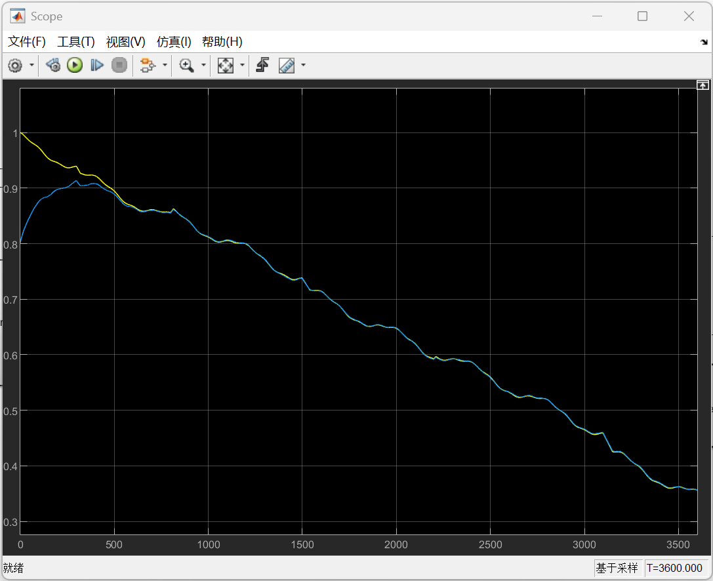
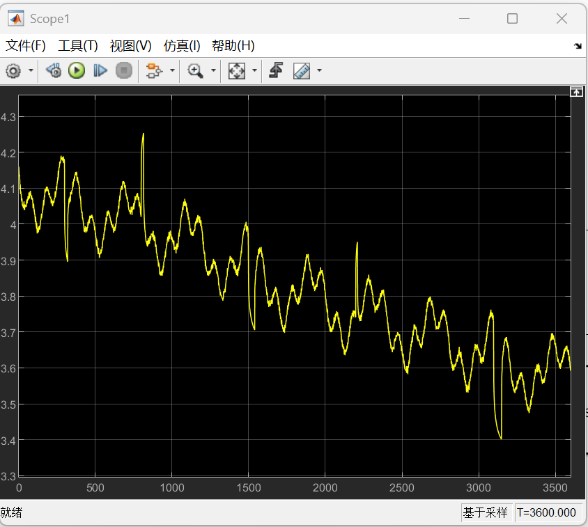
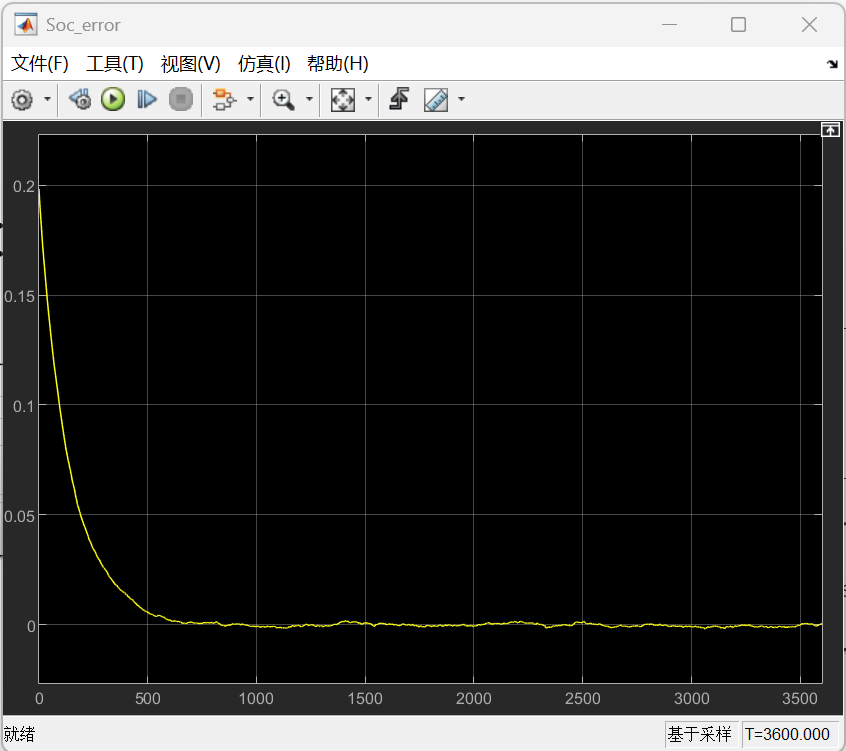

# Battery-SOC-Estimation-EKF


## 📖 Project Overview
This repository contains a Model-in-the-Loop (MIL) simulation platform for Battery State of Charge (SOC) estimation. It addresses the issues of estimation lag and cumulative errors in Electric Vehicles (EVs) under complex urban driving cycles. 

The system utilizes a **2nd-order RC (Dual Polarization) Equivalent Circuit Model** based on a 2.5Ah NMC (Lithium Nickel Manganese Cobalt Oxide) cell and implements a robust **Extended Kalman Filter (EKF)** as the state observer.

## ✨ Key Features & Highlights
- **High-Fidelity Plant Model:** Built in Simscape, featuring dynamic internal resistance and an 11-stage empirical OCV-SOC look-up table to simulate ohmic drop and fast/slow polarization characteristics.
- **Robust EKF Algorithm:** Extends the state-space equations to a 3-dimensional matrix $[SOC, U_{p1}, U_{p2}]^T$. Includes dynamic Jacobian derivation and Kalman gain calculation for optimal sensor fusion.
- **Extreme Accuracy:** Tracks SOC with a maximum absolute error of **< 0.2%** (well below the industry standard of 5%) under severe, highly dynamic load profiles (simulating aggressive acceleration and regenerative braking).
- **Strong Self-Correction:** Successfully recovers from an intentionally injected **80% initial SOC estimation error** (True SOC: 100%, Initial Guess: 20%), suppressing covariance matrix divergence and converging smoothly within ~500 seconds.

## 📊 Simulation Results


### 1. Dynamic SOC Tracking & Convergence
The EKF successfully tracks the true SOC despite intense current fluctuations and an extreme initial offset.

* The blue line (Estimated) converges with the yellow line (True) and maintains precise tracking.*

### 2. Voltage Tracking Under Dynamic Profile

* Simulated terminal voltage (V_meas) capturing the highly dynamic transients of urban driving and regenerative braking.*

### 3. Estimation Error

* The absolute SOC estimation error strictly converges and remains within the $\pm 0.2\%$ boundary.*

## 📂 Repository Structure
```text
Battery-SOC-Estimation-EKF/
│
├── models/                  
│   └── SOC_Estimation_2RC.slx  # Main Simulink model
│
├── scripts/                 
│   ├── Init_Parameters.m       # Initialization for 2RC and NMC cell parameters
│   └── Generate_Profile.m      # Script to generate the 3600s dynamic test cycle
│
├── images/                     # Simulation result plots
│   ├── voltage_tracking.png 
│   ├── soc_convergence.png  
│   └── soc_error.png
│
└── README.md
